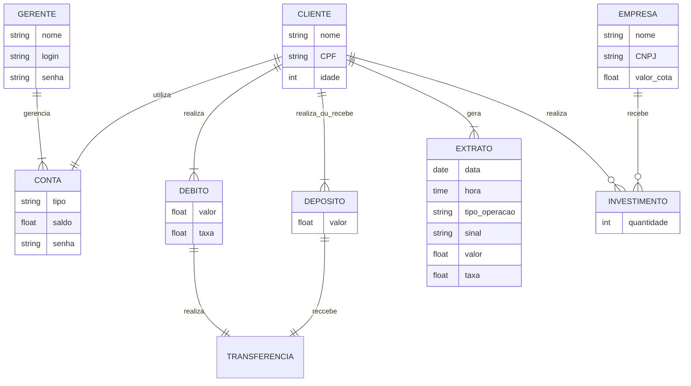
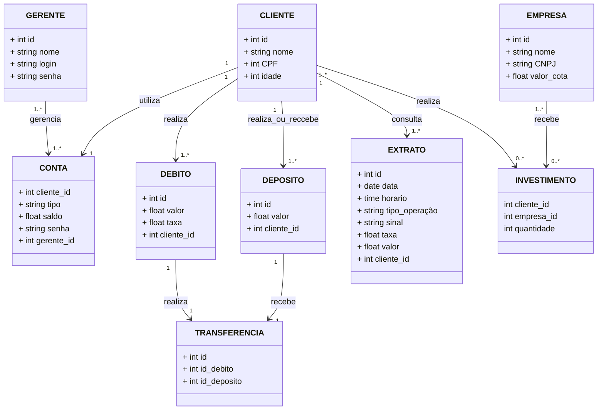

# banco_quempoupatem_banco_de_dados

> Status do projeto: Em andamento

> Esse projeto nos foi proposto no 5ºSemestre na disciplina de Banco de Dados

> Escrevemos esse projeto juntos durante as aulas

### Tópicos
🔹[Diagrama Relacional](#straight_ruler-diagrama-relacional)

🔹[Como executar o código](#space_invader-como-executar-o-código)

🔹[Desenvolvedores](#busts_in_silhouette-desenvolvedores)

## :straight_ruler: Diagrama Relacional
### Modelo de Entidade Relacional

### Modelo Relacional na 3FN

## :space_invader: Como executar o código
### Passos Iniciais
**1º PASSO:** Faça um *git clone* do projeto e abra-o preferencialmente no VSCode.

**2º PASSO:** Faça login ou crie uma conta no Supabase. Insira as informações recebidas ao criar a conta (SUPABASE_URL e SUPABASE_KEY) no arquivo `.env`. Isso permitirá que os dados sejam exibidos no seu perfil.

**3º PASSO:** Execute o código presente no arquivo `createTabelas.sql` no Supabase. Este script criará as tabelas necessárias para armazenar os dados.

**4º PASSO:** Execute o arquivo `main.py`. Assim, o código será iniciado e estará pronto para realizar as operações.

### Rodando o Banco

**1ºPASSO:** Ao rodar o arquivo `main.py` deverá aparecer no seu terminal a mensagem da foto abaixo. Logo, que ela aparecer você deverá escolher uma opção.

   

**2ºPASSO:**

## Realizando Querys

## :busts_in_silhouette: Desenvolvedores
| [ Mariah Santos Gomes](https://github.com/Mariah-Gomes) | [ Iago Rosa de Oliveira](https://github.com/iagorosa28) |
| :---: | :---: |

### Dados dos Desenvolvedores
Iago Rosa de Oliveira R.A.: 22.224.027-7

Mariah Santos Gomes R.A.: 22.224.026-8

### Anotações
- Extrato join de todos
- Colocar as datas para todos
- A gnt nn precisa fazer a parte de insert de update, só fazer cadastrar e as 10 operações
