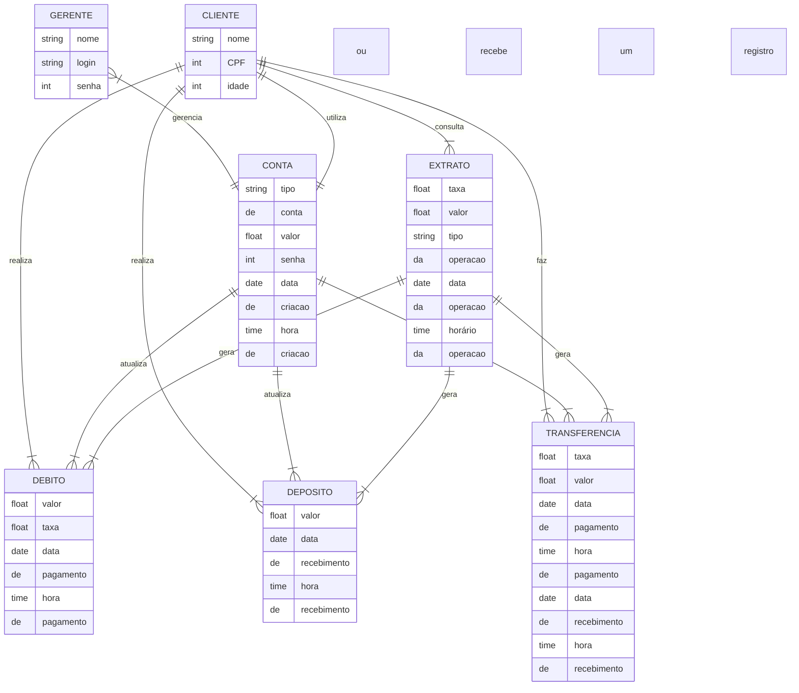

# banco_quempoupatem_banco_de_dados

```mermaid
erDiagram
    CLIENTE {
    string nome
    int CPF
    int idade
    }

    GERENTE {
    string nome
    string login
    int senha
    }

    CONTA {
    string tipo de conta
    float valor
    int senha
    date data de criacao
    time hora de criacao
    }

    DEBITO {
    float valor
    float taxa
    date data de pagamento
    time hora de pagamento
    }

    DEPOSITO {
    float valor
    date data de recebimento
    time hora de recebimento
    }

    TRANSFERENCIA {
    float taxa
    float valor
    date data de pagamento
    time hora de pagamento
    date data de recebimento
    time hora de recebimento
    }

    EXTRATO {
    float taxa
    float valor
    string tipo da operacao 
    date data da operacao
    time horário da operacao
    }

    GERENTE }| -- || CONTA : gerencia
    CLIENTE || -- || CONTA : utiliza
    CLIENTE || -- |{ DEBITO : realiza
    CLIENTE || -- |{ DEPOSITO : realiza
    CLIENTE || -- |{ TRANSFERENCIA : faz ou recebe
    CLIENTE || -- |{ EXTRATO : consulta
    CONTA || -- |{ DEBITO : atualiza
    CONTA || -- |{ DEPOSITO : atualiza
    CONTA || -- |{ TRANSFERENCIA : atualiza
    EXTRATO || -- |{ DEBITO : gera um registro
    EXTRATO || -- |{ DEPOSITO : gera um registro
    EXTRATO || -- |{ TRANSFERENCIA : gera um registro

```
