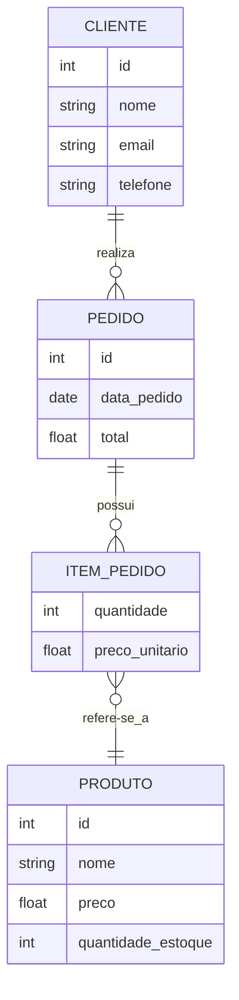
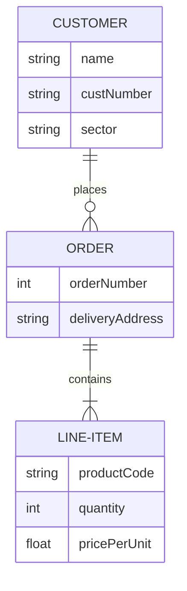

# banco_quempoupatem_banco_de_dados

```mermaid
erDiagram
    CLIENTE {
        int id
        string nome
        string email
        string telefone
    }
    
    PEDIDO {
        int id
        date data_pedido
        float total
    }
    
    PRODUTO {
        int id
        string nome
        float preco
        int quantidade_estoque
    }

    ITEM_PEDIDO {
        int quantidade
        float preco_unitario
    }

    CLIENTE ||--o{ PEDIDO : realiza
    PEDIDO ||--o{ ITEM_PEDIDO : possui
    ITEM_PEDIDO }o--|| PRODUTO : refere-se_a
```

```mermaid
erDiagram
    CUSTOMER ||--o{ ORDER : places
    CUSTOMER {
        string name
        string custNumber
        string sector
    }
    ORDER ||--|{ LINE-ITEM : contains
    ORDER {
        int orderNumber
        string deliveryAddress
    }
    LINE-ITEM {
        string productCode
        int quantity
        float pricePerUnit
    }
```
