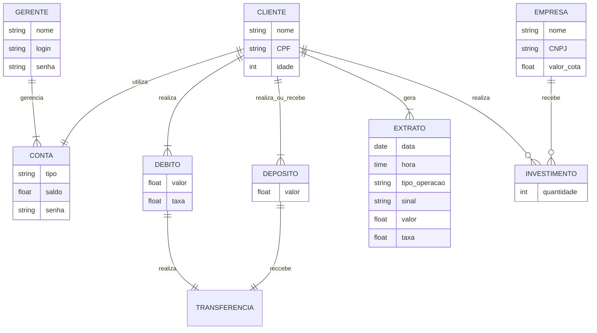
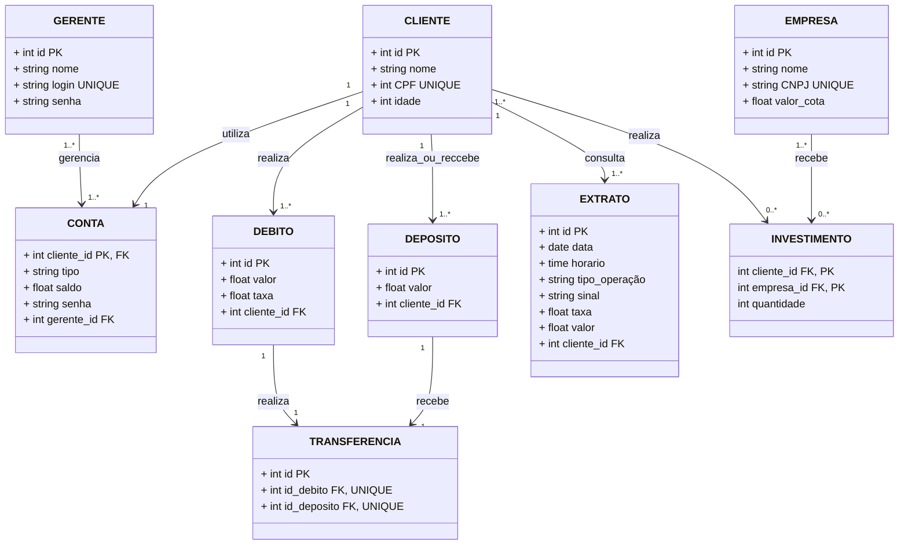

# banco_quempoupatem_banco_de_dados

> Status do projeto: Finalizado

> Esse projeto nos foi proposto no 5ºSemestre na disciplina de Banco de Dados

> Escrevemos esse projeto juntos durante as aulas

### Tópicos
🔹[Diagrama Relacional](#straight_ruler-diagrama-relacional)

🔹[Como executar o código](#space_invader-como-executar-o-código)

🔹[Desenvolvedores](#busts_in_silhouette-desenvolvedores)

## :straight_ruler: Diagrama Relacional
### Modelo de Entidade Relacional

### Modelo Relacional na 3FN

## :space_invader: Como executar o código
### Passos Iniciais
**1º PASSO:** Faça um *git clone* do projeto e abra-o preferencialmente no VSCode.

**2º PASSO:** Faça login ou crie uma conta no Supabase. Insira as informações recebidas ao criar a conta (SUPABASE_URL e SUPABASE_KEY) no arquivo `.env`. Isso permitirá que os dados sejam exibidos no seu perfil.

**3º PASSO:** Execute o código presente no arquivo `createTabelas.sql` no Supabase. Este script criará as tabelas necessárias para armazenar os dados.

**4º PASSO:** Execute o arquivo `main.py`. Assim, o código será iniciado e estará pronto para realizar as operações.

### Rodando o Banco

**1º PASSO:** Ao rodar o arquivo `main.py`, deverá aparecer no terminal a mensagem exibida na imagem abaixo. Assim que ela aparecer, escolha uma das opções.

   

 

**2º PASSO:** É recomendado que, inicialmente, selecione a opção "Gerente", pois apenas o gerente pode criar contas. Após criar uma conta, o cliente poderá acessar e realizar as operações. Portanto, primeiro selecione a opção "Gerente". O menu seguinte será exibido:

   

 

**3º PASSO:** No primeiro acesso, é necessário cadastrar um gerente, pois o banco de dados ainda não possui clientes cadastrados. Para isso, selecione a opção "Cadastrar". Caso já exista um gerente cadastrado, este passo pode ser ignorado, e você pode realizar o login diretamente.

***IMPORTANTE:*** Para algumas operações, como cadastrar ou excluir um gerente no banco de dados, será necessário inserir a senha **15072023**.

   

 

**4º PASSO:** Após cadastrar um gerente, faça login. Em seguida, será exibido o menu com as operações que o gerente pode realizar no banco. Lembre-se: apenas o gerente pode cadastrar contas. Antes de acessar a opção "Cliente" no menu principal, é necessário que o gerente tenha cadastrado um cliente no banco de dados.

   

 

**5º PASSO:** Com uma conta criada, é possível acessar a opção "Cliente" no menu principal. A conta criada já estará salva no banco de dados, então, mesmo que o programa seja fechado e reaberto, não será necessário cadastrá-la novamente.

   

 

**6º PASSO:** Ao retornar ao menu principal (saindo e escolhendo a opção "Cliente"), o sistema solicitará os dados do cliente cadastrados por um gerente. Se os dados estiverem corretos, o cliente poderá acessar o menu de operações da sua conta. Após o login, não será necessário inserir CPF e senha novamente para realizar outras operações.

   

 

### Realizando Querys
**1ºPASSO:** Selecione o arquivo `query.sql` e execute query por query no Supabase. As queries estão numeradas, e ao lado do número há a descrição do que cada uma faz.

## :busts_in_silhouette: Desenvolvedores
| [ Mariah Santos Gomes](https://github.com/Mariah-Gomes) | [ Iago Rosa de Oliveira](https://github.com/iagorosa28) |
| :---: | :---: |

### Dados dos Desenvolvedores
Iago Rosa de Oliveira R.A.: 22.224.027-7

Mariah Santos Gomes R.A.: 22.224.026-8
