# banco_quempoupatem_banco_de_dados

> Status do projeto: Em andamento

> Esse projeto nos foi proposto no 5ºSemestre na disciplina de Banco de Dados

> Escrevemos esse projeto juntos durante as aulas

### Tópicos
🔹[Diagrama Relacional](#straight_ruler-diagrama-relacional)

🔹[Como executar o código](#space_invader-como-executar-o-código)

🔹[Desenvolvedores](#busts_in_silhouette-desenvolvedores)

## :straight_ruler: Diagrama Relacional
### Modelo de Entidade Relacional

### Modelo Relacional na 3FN

```mermaid
classDiagram
    class CLIENTE
    CLIENTE : + string nome
    CLIENTE : + int CPF
    CLIENTE : + int idade

    class GERENTE
    GERENTE : + string nome
    GERENTE : + string login
    GERENTE : + int senha

    class CONTA
    CONTA : + string tipo de conta
    CONTA : + float valor
    CONTA : + int senha
    CONTA : + date data de criação
    CONTA : + time hora de criação

    class DÉBITO
    DÉBITO : + float valor
    DÉBITO : + float taxa
    DÉBITO : + date data de pagamento
    DÉBITO : + time hora de pagamento

    class DEPÓSITO
    DEPÓSITO : + float valor
    DEPÓSITO : + date data de recebimento
    DEPÓSITO : + time hora de recebimento

    class TRANSFERÊNCIA
    TRANSFERÊNCIA : + float taxa
    TRANSFERÊNCIA : + float valor
    TRANSFERÊNCIA : + date data de pagamento
    TRANSFERÊNCIA : + time hora de pagamento
    TRANSFERÊNCIA : + date data de recebimento
    TRANSFERÊNCIA : + time hora de recebimento

    class EXTRATO
    EXTRATO : + float taxa
    EXTRATO : + float valor
    EXTRATO : + string tipo da operação
    EXTRATO : + date data da operação
    EXTRATO : + time horario da operação

    CLIENTE "1" --> "1" CONTA : utiliza
    CLIENTE "1" --> "1..*" DÉBITO : realiza
    CLIENTE "1" --> "1..*" DEPÓSITO : realiza
    CLIENTE "1" --> "1..*" TRANSFERÊNCIA : faz_ou_recebe
    CLIENTE "1" --> "1..*" EXTRATO : consulta
    CONTA "1" --> "1..*" DÉBITO : atualiza
    CONTA "1" --> "1..*" DEPÓSITO : atualiza
    CONTA "1" --> "1..*" TRANSFERÊNCIA : atualiza
    EXTRATO "1" --> "1..*" DÉBITO : gera_um_registro
    EXTRATO "1" --> "1..*" DEPÓSITO : gera_um_registro
    EXTRATO "1" --> "1..*" TRANSFERÊNCIA : gera_um_registro
    GERENTE "1..*" --> "1" CONTA : gerencia
```

## :space_invader: Como executar o código

## :busts_in_silhouette: Desenvolvedores
| [ Mariah Santos Gomes](https://github.com/Mariah-Gomes) | [ Iago Rosa de Oliveira](https://github.com/iagorosa28) |
| :---: | :---: |

### Dados dos Desenvolvedores
Iago Rosa de Oliveira R.A.: 22.224.027-7
Mariah Santos Gomes R.A.: 22.224.026-8
